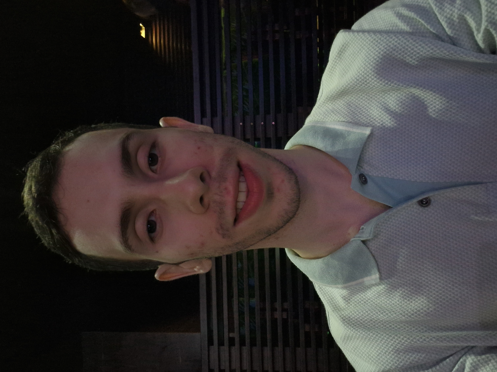

# Bem-vind@ ao BootCamp de Visão Computacional + IA na prática

--- 

BootCamp na Semana de C&T: 10, 11 e 12 de Novembro de 2026.

## Cronograma

#### `Dia 01:` Fundamentos de Imagens Digitais
* Definição e representação de imagem computacionalmente
* Canais, filtros e máscaras.

#### `Dia 02:` Modelos de Visão Computacional
* Introdução a visão computacional e uso de IA;
    - Operações com vídeos: abertura, processamento e reprodução.
* Classificiação, segmentação e pose;
* Prática: 

#### `Dia 03:` Agentes + Visão Computacional
* A

## Equipe
* Professor responsável: [Helton Maia (Professor )](https://heltonmaia.com/)
<!-- { .circular } -->
* Ministrante: [Marcos Aurélio Tavares Filho (Engenharia de Computação)](https://www.linkedin.com/in/marcos-aurelio-tavares-filho)
* Monitores: João Victor (Engenharia ????) Sara Thamyres (Ciência e Tecnologia)
